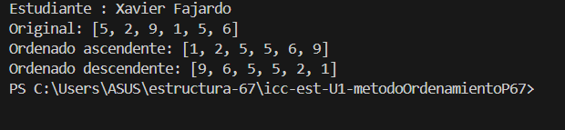
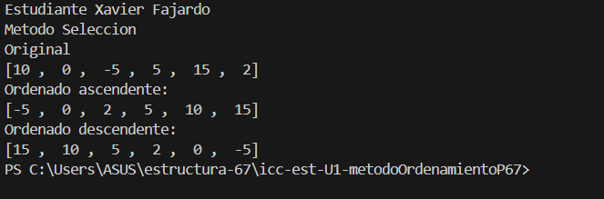
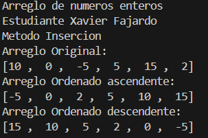
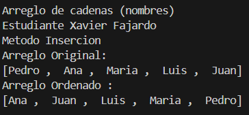
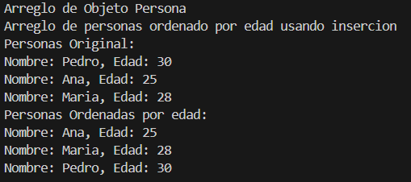
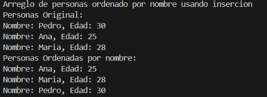

# Estructura de Datos

## Estudiante: ## Xavier Fajardo

## Metodos de Ordenamiento

## Practica 1 - 20/OCT
Metodo Sort Bubble

### Practica 2- 21/OCT
Metodo Sort Selecction en java y Python

## Salida Python

## Salida Java

## Deber Metodo de Inserccion - 26/OCT
# 1. Arreglo de números enteros

# 2. Arreglo de cadenas (nombres)

# 3. Arreglo de personas ordenado por edad 

# 4. Arreglo de personas ordenado por edad

